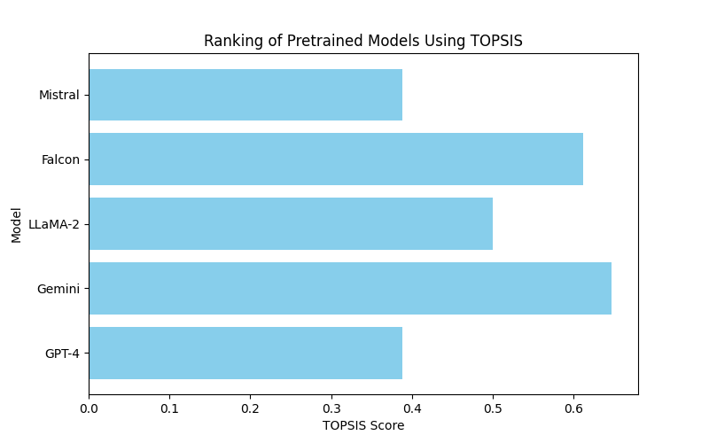

# TOPSIS Analysis for Text Generation Models

This repository contains the analysis of different pretrained text generation models using the TOPSIS method.

## Overview
TOPSIS (Technique for Order Preference by Similarity to Ideal Solution) is a multi-criteria decision-making technique that helps in ranking models based on various performance metrics.

## Models Evaluated
- GPT-4
- LLaMA-2
- Falcon
- Mistral
- Gemini

## Criteria Used
- BLEU Score (Higher is better)
- Perplexity (Lower is better)
- Inference Speed (Higher is better)
- Token Efficiency (Higher is better)
- Cost (Lower is better)

## Results
### Ranked Models
```markdown
{results_df.to_markdown(index=False)}
```



## Files in Repository
- `MaanyaWalia_102203351.py` - Python script to perform TOPSIS analysis
- `topsis_results.csv` - Results in CSV format
- `topsis_results.md` - Results in Markdown format
- `topsis_ranking.png` - Bar chart visualization
- `README.md` - Project description for GitHub

## How to Run
1. Install dependencies: `pip install numpy pandas matplotlib`
2. Run the script: `python topsis_analysis.py`

